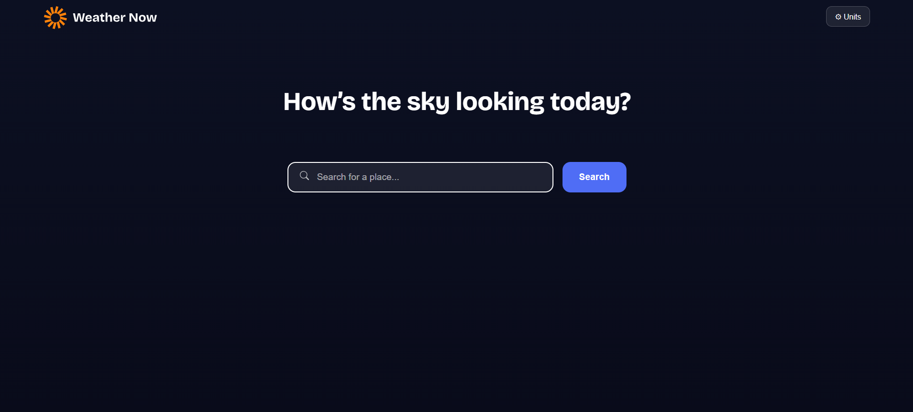
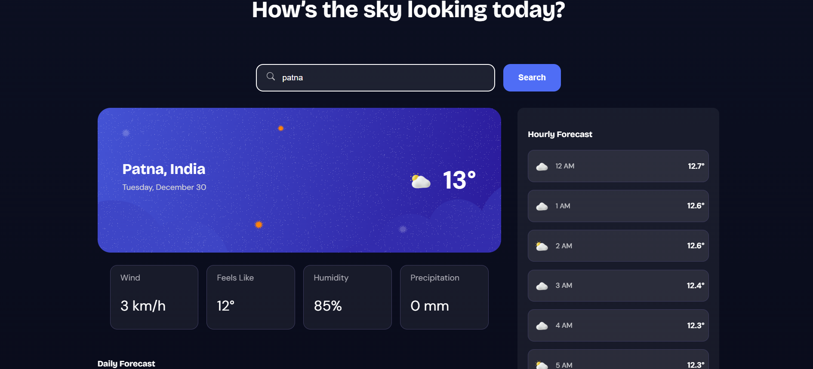

---

# Frontend Mentor - Weather app solution

This is a solution to the [Weather app challenge on Frontend Mentor](https://www.frontendmentor.io/challenges/weather-app-K1FhddVm49). This project focuses on building a responsive, data-driven weather application with a clean UI and smooth user interactions.

## Table of contents

* [Overview](#overview)

  * [The challenge](#the-challenge)
  * [Screenshot](#screenshot)
  * [Links](#links)
* [My process](#my-process)

  * [Built with](#built-with)
  * [What I learned](#what-i-learned)
  * [Continued development](#continued-development)
  * [Useful resources](#useful-resources)
* [Author](#author)

---

## Overview

### The challenge

Users should be able to:

* Search for weather information by entering a location
* View current weather details such as temperature, condition icon, and location
* See additional metrics including feels-like temperature, humidity, wind speed, and precipitation
* Browse a 7-day daily forecast with high/low temperatures
* View an hourly forecast for selected days
* Switch between days in the hourly forecast
* Toggle between Metric and Imperial units (temperature, wind speed, precipitation)
* Experience an optimal layout across mobile and desktop devices
* See hover and focus states for interactive elements

---

### Screenshot

---

### Links

* **Solution URL:** [https://www.frontendmentor.io/solutions/responsive-weather-app-uU1yeVKari](https://www.frontendmentor.io/solutions/responsive-weather-app-uU1yeVKari)
* **Live Site URL:** [https://anika57.github.io/Weather_app/](https://anika57.github.io/Weather_app/)

---

## My process

### Built with

* Angular (Standalone Components)
* TypeScript
* Semantic HTML5
* SCSS
* Flexbox & CSS Grid
* Mobile-first workflow
* Open-Meteo API

---

### What I learned

* Managing shared state such as unit preferences across multiple components
* Handling API responses and transforming data for UI-friendly formats
* Implementing responsive layouts for complex dashboards
* Improving UX with keyboard events, dropdown interactions, and outside-click handling
* Structuring an Angular app using reusable, standalone components

---

### Continued development

* Add loading and error states for API requests
* Improve accessibility (ARIA roles and keyboard navigation)
* Add geolocation-based weather detection
* Enhance performance with caching and memoization

---

### Useful resources

* [Open-Meteo API Docs](https://open-meteo.com/en/docs) – For weather and forecast data
* [Angular Documentation](https://angular.dev/) – Component and event handling
* [Frontend Mentor Community](https://www.frontendmentor.io/community) – Feedback and inspiration

---

## Author

* Frontend Mentor – [@anika57](https://www.frontendmentor.io/profile/anika57)
* GitHub – [https://github.com/anika57](https://github.com/anika57)

---

